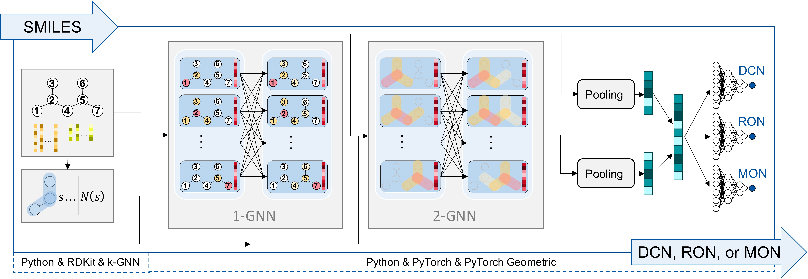
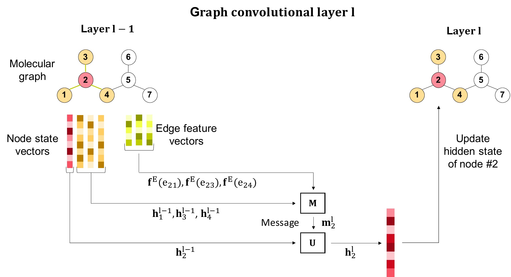

# Graph neural networks for ignition quality prediction

small test to see if git push and pull works

This is the source code for the paper **Graph Neural Networks for Prediction of Fuel Ignition Quality** (**[https://doi.org/10.1021/acs.energyfuels.0c01533](https://doi.org/10.1021/acs.energyfuels.0c01533)**). 

You can also run the code via our free web frontend avaibale here: [https://www.avt.rwth-aachen.de/gnn](https://www.avt.rwth-aachen.de/gnn)

## Overall model structure



## Graph convolution



## Required packages

The code is built upon: 

* **[PyTorch Geometric package](https://github.com/rusty1s/pytorch_geometric)**
* **[k-GNN package](https://github.com/chrsmrrs/k-gnn)**
* **[RDKit package](https://www.rdkit.org/)**

which need to be installed before using our code.

Please follow their **installation instructions**: **[PyTorch Geometric](https://pytorch-geometric.readthedocs.io/en/latest/notes/installation.html)**, **[k-GNN](https://github.com/chrsmrrs/k-gnn)**, **[RDKit](https://www.rdkit.org/docs/Install.html)**.

## Usage

This repository contains following folders:

* **Data**: training and test data sets
* **dep**: dependencies to other packages
* **smiles_to_molecular_graphs**: convert SMILES strings into molecular graphs
* **src**: source code
* **trained_models**: trained model ensemble for predicting DCN, MON, RON
* **training_script**: train individual singletask or multitask models or apply transfer learning, e.g., variation of hyperparameters or data sets


## How to cite this work

Please cite [our paper](https://doi.org/10.1021/acs.energyfuels.0c01533) if you use this code:

This paper:

```
@article{Schweidtmann.2020,
 author = {Schweidtmann, Artur M. and Rittig, Jan G. and K{\"o}nig, Andrea and Grohe, Martin and Mitsos, Alexander and Dahmen, Manuel},
 title = {Graph Neural Networks for Prediction of Fuel Ignition Quality},
 journal = {Energy {\&} Fuels},  
 pages = {11395--11407},
 volume = {34},
 number = {9},
 issn = {0887-0624},
 year = {2020},
 doi = {10.1021/acs.energyfuels.0c01533},
}
```

Please also refer to the corresponding packages, that we use, if appropiate:

Pytorch Geomteric:

```
@inproceedings{Fey/Lenssen/2019,
  title={Fast Graph Representation Learning with {PyTorch Geometric}},
  author={Fey, Matthias and Lenssen, Jan E.},
  booktitle={ICLR Workshop on Representation Learning on Graphs and Manifolds},
  year={2019},
}
```

k-GNN:

```
@inproceedings{morritfey.19,
  author =        {C. Morris and M. Ritzert and M. Fey and W. Hamilton and J.E. Lenssen and G. Rattan and M. Grohe},
  booktitle =     {Proceedings of the 33rd AAAI Conference on Artificial Intelligence, 27.01.-01.02.2019, Honolulu, Hawaii, United States},
  publisher =     {{AAAI} Press},
  title =         {Weisfeiler and Leman go neural: Higher-order graph neural networks},
  volume =        {4602-4609},
  year =          {2019},
  url =           {http://arxiv.org/pdf/1810.02244v3},
}
```

RDKit:

```
@misc{rdkit,
 author = {{Greg Landrum}},
 title = {RDKit: Open-Source Cheminformatics},
 url = {http://www.rdkit.org}
}
```
